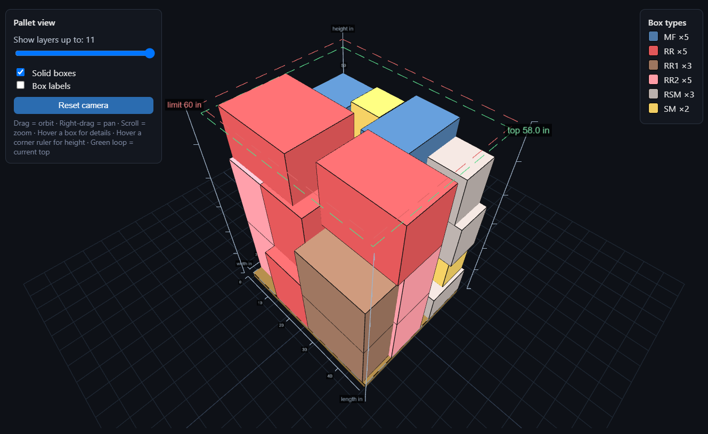
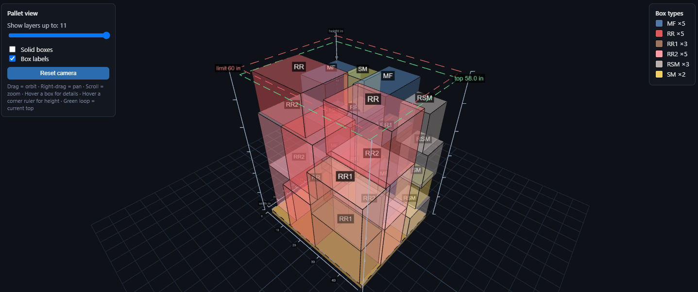
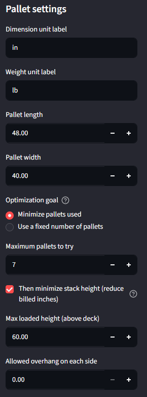
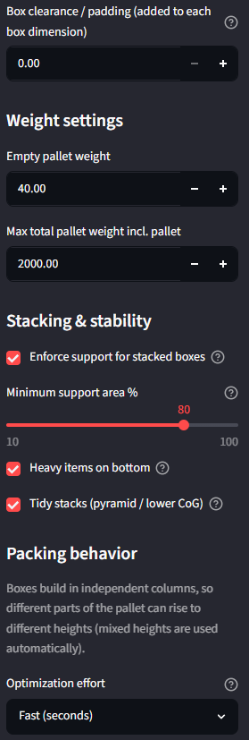
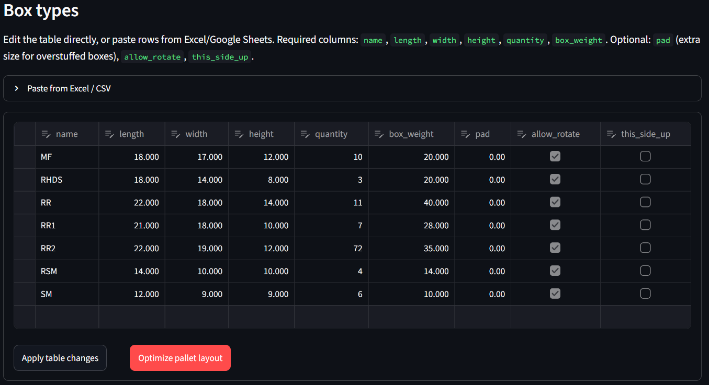
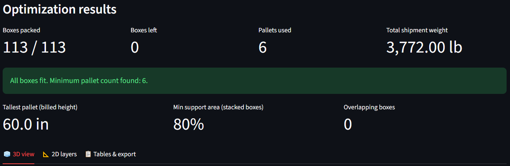
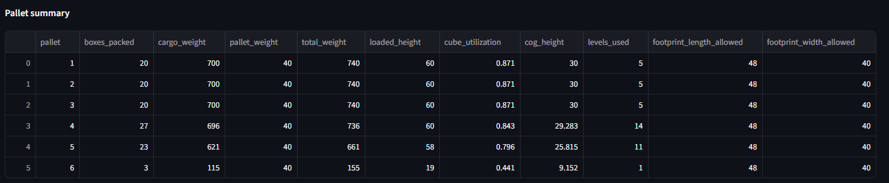
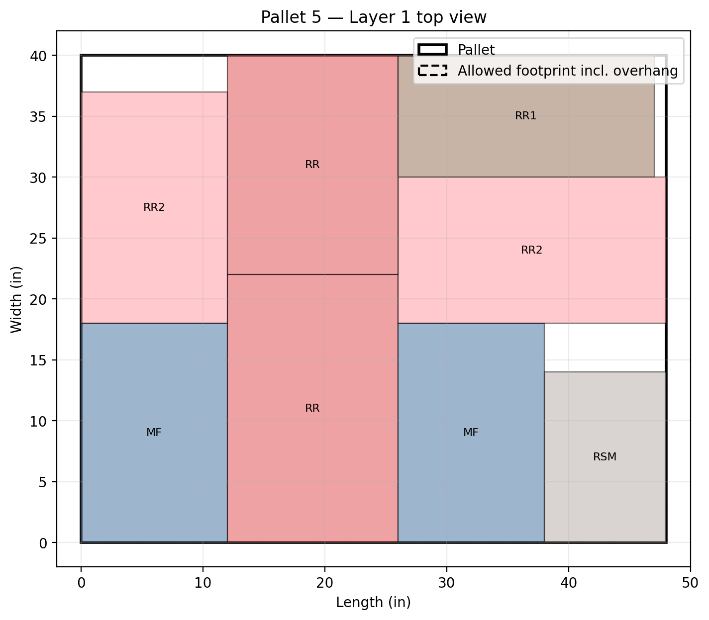

# Pallet Shipment Optimizer

This is a program I built for Summer 2026 internship that figures out how to load boxes onto shipping pallets.
You give it your box sizes, quantities, and weights, plus your pallet dimensions and
limits, and it tells you how to stack everything using as few pallets (and as little
height) as it can without the stacks being unstable. Then you can walk around the
result in a 3D model to actually see where each box goes.

I made it because packing a pallet well saves a lot of money and helps replenish more SKUs per shipment to Amazon. 
Every extra pallet costs you, and a lot of freight is billed by the inch of height, so shaving a few
inches off a stack adds up. Doing this by hand is tedious and it's easy to leave
space on the table. It turns out packing boxes optimally is an NP-hard problem, so
there's no quick formula for the perfect answer. Instead the program uses a few
different packing strategies, tries a bunch of arrangements, and keeps the best one.

Built with Python (Streamlit for the interface, NumPy for the heavy math) and
Three.js for the 3D view.

---

## Screenshots

<!-- Add images to docs/screenshots/ (that folder's README lists the exact filenames). -->



The 3D view. You can drag to rotate, scroll to zoom, and hover over a box to see its
size and weight. The slider peels the stack back one level at a time, the rulers on
the corners show height, and the green outline marks how tall the currently-shown
part of the stack is.



Same pallet with "Solid boxes" turned off and labels on, so you can see how every box
is stacked all the way through, not just the outside.

The sidebar has a lot of settings, so here it is in two parts:

| Pallet, goal & height | Weight, stability & effort |
|---|---|
|  |  |

Here's the box table you type into:



And the results you get back — the summary numbers up top:



...and a full per-pallet breakdown in the Tables & export tab (weight, height, how
full each pallet is, center of gravity, and so on), which you can also download as CSV:





A top-down blueprint of one pallet layer. The app also has a matching side view, but
I mostly just use the 3D view, so this is the one I grabbed.

---

## What it does

- **Packs pallets two different ways and keeps whichever is better.** One packer
  works like a person actually loading a pallet: it lays down a clean grid of one box
  type across the base, then stacks each spot straight up into a full-height column,
  then fills whatever's left over with the next box type. The other one is more
  freeform: every spot on the pallet grows to its own height, so tall and short boxes
  can sit next to each other and short boxes don't waste the space above them. The
  grid packer is great for uniform loads; the freeform one is better for messy mixes.
  On a real 7-box-type load I was testing, running both bumped the space usage from
  about 80% up to 88%, which is basically as good as that box/pallet combo can get.
- **Minimizes pallets first, then height.** Its main goal is fewest pallets. If you
  turn on the height option, it then searches for the shortest the stacks can be while
  still fitting in that many pallets, since height is what you get billed for.
- **Keeps the stacks from tipping.** You can set how much of a box has to actually be
  resting on the boxes below it (default 80%), so nothing ends up floating or hanging
  off an edge. It also tries to keep heavier boxes lower so the center of gravity
  stays down, and it double-checks that no two boxes overlap after it's done.
- **Rotates boxes in 3D.** A box can be turned onto any of its six faces to fit
  better, unless you mark it "this side up," in which case it stays upright.
- **Has a fast mode and a slow-but-thorough mode.** Fast finishes in a couple seconds
  on one core. Thorough throws a lot more attempts at it across all your CPU cores.
  Maximum runs a deep search for however many minutes you give it and keeps the best
  layout it finds. (This is a CPU problem, not a GPU one, so more cores and more tries
  is the way to get better answers.)
- **Handles the real-world details.** Pallet overhang, max load height, empty pallet
  weight and a total weight cap, and a padding setting for boxes that get stuffed so
  full they bulge out past their listed size.
- **Lets you enter data however's easiest.** Edit the table directly, or paste rows
  from Excel, Google Sheets, or just a plain list. It handles spaces, tabs, or commas,
  with or without a header row.

---

## Running it

You'll need Python 3.10 or newer.

```bash
pip install -r requirements.txt
streamlit run pallet_optimizer_app.py
```

It opens in your browser at `http://localhost:8501`. Everything runs on your own
machine. The only thing that needs internet is the 3D view, which pulls the Three.js
library from a CDN while that tab is open.

Once it's up:

1. Set your pallet size, max height, and weight limits in the sidebar.
2. Type your boxes into the table, or paste a list under "Paste from Excel / CSV."
3. Pick an effort level (Fast is fine to start).
4. Hit "Optimize pallet layout."
5. Look through the results — the numbers up top, then the 3D view, 2D layers, and
   the tables/export tabs.

### Sample data

There's a sample shipment in [`sample_boxes.csv`](sample_boxes.csv) you can paste
straight in (headers are optional):

```
name    length  width   height  quantity  box_weight
MF      18      17      12      10        20
RHDS    18      14      8       3         20
RR      22      18      14      11        40
RR1     21      18      10      7         28
RR2     22      19      12      72        35
RSM     14      10      10      4         14
SM      12      9       9       6         10
```

Every box needs a name, length, width, height, quantity, and weight; the rest of the
columns are optional. Units don't matter as long as you're consistent (inches and
pounds, or centimeters and kilograms, whatever). Every column and setting is listed in
the next section.

---

## Settings, and what they all do

I mostly keep this list for my own reference, but it also explains why each knob is
there in the first place.

### Box table

| Column | Required? | What it does |
|--------|-----------|--------------|
| `name` | yes | Label for the box type. Has to be unique. With space-separated paste it can't contain spaces. |
| `length`, `width`, `height` | yes | The box's dimensions. |
| `quantity` | yes | How many of this box you're shipping. |
| `box_weight` | yes | Weight of one box. Drives the per-pallet weight cap and the center-of-gravity math. |
| `pad` | no (default 0) | Extra size added to each dimension of this box only. For boxes that get stuffed so full they bulge past their listed size, so the plan reserves the room they actually take. |
| `allow_rotate` | no (default on) | Whether the box may be turned to fit better. Off means it's placed exactly as entered. |
| `this_side_up` | no (default off) | Keeps the box upright. It can still spin flat on its base, but it won't be tipped onto a side. For fragile or liquid stuff. |

### Sidebar — pallet & goal

| Setting | Default | What it does / why |
|---------|---------|--------------------|
| Dimension unit label | `in` | Just the label shown on axes and numbers. Cosmetic; the math is unit-agnostic. |
| Weight unit label | `lb` | Same idea, for weights. |
| Pallet length / width | 48 × 40 | The pallet footprint. (48×40 is the standard US pallet.) |
| Optimization goal | Minimize pallets used | "Minimize" tries 1 pallet, then 2, and so on, using the fewest that fit everything. "Fixed number" packs into exactly the count you set. |
| Maximum pallets to try | 20 | (Minimize mode) An upper limit so the search doesn't run forever if something just can't fit. |
| Number of pallets available | 1 | (Fixed mode) Packs into exactly this many pallets. |
| Then minimize stack height | off | (Minimize mode) After finding the fewest pallets, also search for the shortest the stacks can be. Freight is often billed by the inch, so this saves money. Slower. |
| Max loaded height (above deck) | 60 | How tall the box stack can get, measured from the top of the pallet deck (the pallet itself isn't counted). Usually your trailer/door clearance minus the pallet height. |
| Allowed overhang on each side | 0 | How far boxes may stick out past the pallet edge, if your setup allows it. |
| Box clearance / padding | 0 | Extra size added to every box (on top of any per-box `pad`). A global safety gap so the plan isn't packed tighter than what actually happens on the floor. |

### Sidebar — weight

| Setting | Default | What it does / why |
|---------|---------|--------------------|
| Empty pallet weight | 40 | Weight of the bare pallet. Counts toward the total and shows up in the shipment weight. |
| Max total pallet weight incl. pallet | 2000 | Most a loaded pallet can weigh, pallet included. Keeps stacks under floor-load or forklift limits; the packer stops adding boxes before it goes over. |

### Sidebar — stacking & stability

| Setting | Default | What it does / why |
|---------|---------|--------------------|
| Enforce support for stacked boxes | on | Whether upper boxes have to actually rest on the ones below. Turn it off only if you don't care about physical realism. |
| Minimum support area % | 80 | How much of a box's base has to be sitting on boxes below it (it can span several). Higher is more stable but may use more pallets. |
| Heavy items on bottom | on | Among equally good packings, prefer the one with the lower center of gravity, so heavy boxes end up low. |
| Tidy stacks (pyramid / lower CoG) | on | After packing, rearrange the same boxes into a neater, more pyramid-like shape — but only if it still fits at the same height, so it never costs any efficiency. |

### Sidebar — packing effort

| Setting | Default | What it does / why |
|---------|---------|--------------------|
| Optimization effort | Fast | How hard to search. Fast is one core and a few seconds. Thorough tries many more arrangements across all your cores. Maximum runs a timed deep search across all cores. |
| Time budget (minutes) | 2 | (Maximum only) How long the deep search runs before it stops and returns the best layout it found. |

---

## How it works under the hood

I kept the packing logic ([`engine.py`](engine.py)) separate from the interface so I
could test it on its own without spinning up the whole app.

The main packer places boxes one at a time, each in the lowest open corner where it
fits and has enough support underneath. The naive version of that was slow, so I
rewrote the inner loop to check every candidate spot at once with NumPy instead of a
Python loop, and added a small cache so it stops re-testing identical boxes against a
surface that hasn't changed. That took one 370-box test case from around 166 seconds
down to about 6.

The other packer was the one that surprised me. For loads that are mostly one box
type, letting the greedy packer rotate boxes freely actually made things worse — it
would turn the first box sideways and break up the grid, so it fit 3 across a row
instead of 4. Loading it like a person would, in a clean repeating grid, packs way
tighter. So I wrote a separate grid-based packer for that and let the program pick
whichever result is denser for each pallet.

For the "try harder" modes, each pallet gets packed a bunch of different ways (a few
sorting strategies plus random shuffles) and the densest one wins. The maximum-effort
mode wraps that in a timed loop that runs across all CPU cores and keeps searching
until your time budget runs out. The height-minimizing option is a binary search: it
keeps lowering the height limit to find the flattest load that still fits.

Since the problem is NP-hard, none of this is guaranteed to be the absolute best
possible packing — it's a good practical answer, found quickly. Height is measured
from the top of the pallet deck, so it's just the box stack, not the pallet itself.

---

## Files

| File | What it is |
|------|-----------|
| [`pallet_optimizer_app.py`](pallet_optimizer_app.py) | The Streamlit app — inputs, results tabs, CSV export. |
| [`engine.py`](engine.py) | All the packing logic and data models. Just Python and NumPy, no UI. |
| [`viewer3d.py`](viewer3d.py) | Generates the Three.js 3D view. |
| [`test_engine.py`](test_engine.py) | Tests for the engine (11 of them). |
| [`sample_boxes.csv`](sample_boxes.csv) | The example shipment. |

## Tests

```bash
python test_engine.py
```

There are 11 tests. They check things like: every box actually gets placed, no two
boxes overlap in 3D, the support rule holds, "this side up" boxes keep their height,
the weight cap is respected, the grid packer hits its theoretical max, and the
height-minimizing and multi-core searches return valid layouts.

---

## Some things worth knowing

- It's a heuristic, so it gets close to optimal, not provably optimal.
- The 3D view needs internet (it loads Three.js from a CDN); nothing else does.
- If you paste space-separated data, box names can't have spaces in them — use tabs
  or commas if you need multi-word names.
- It doesn't tilt boxes at an angle. I looked into it, but for rectangular boxes a
  box is always shortest lying flat, which it already tries, so tilting can't actually
  save height.
